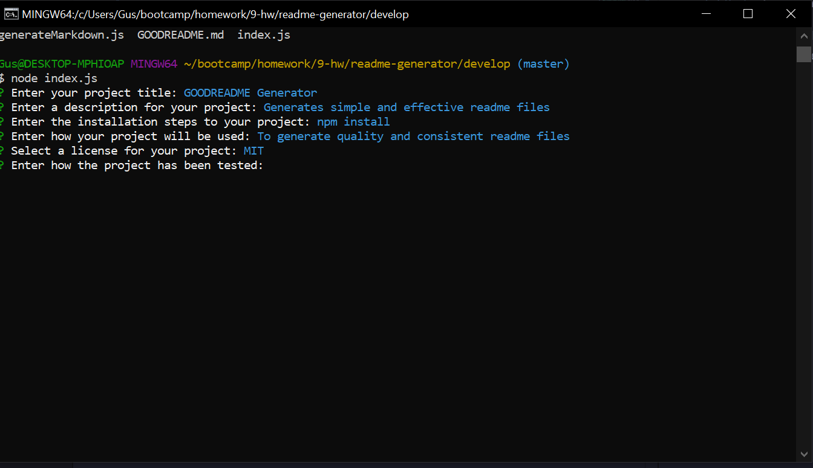
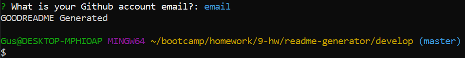
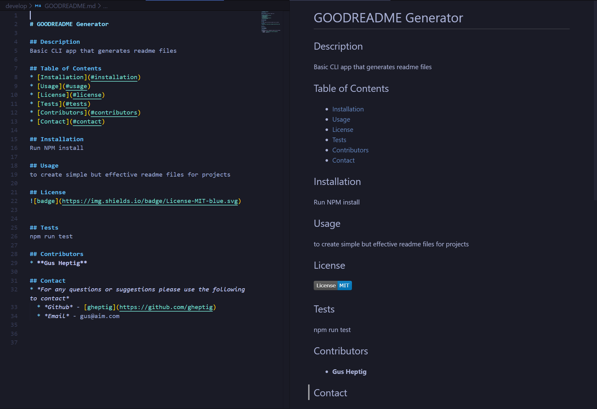

# Good Readme Generator

## Brief Description
This is a basic CLI application that prompts users a series of inputs/questions using Node.js.  This app is to be used to build and create simple, effective, and consistent README files that can be used for projects. When a user is finished answering the inputs/questions a README markdown file is generated and a the user's command line displays "GOODREADME Generated".

The markdown file contains a basic structure for a README that can be used for a user's project(s).  The generated README file uses the following structure.

* Title of Project
* Description of Project
* Table of Contents
* Installation 
* Usage
* License
* Tests
* Contributors
* Contact
    * Github Username
    * Github Email

## Technologies Used

[JavaScript](https://developer.mozilla.org/en-US/docs/Web/JavaScript) - This application is written and programmed using ES6 JavaScript.

[Node.js](https://nodejs.org/en/about/) - Used to open, read, and write file(s) on server and return content to client.

[Git Bash](https://gitforwindows.org/index.html) - Command line tool used to test and get application to function.

[NPM Inquirier](https://www.npmjs.com/package/inquirer) - NPM package used to prompt user with inputs/questions on the command line to be then used to genreate markdown file.

## Preview

## Contributers/Authors

* Augustus Heptig - Author/Creator
